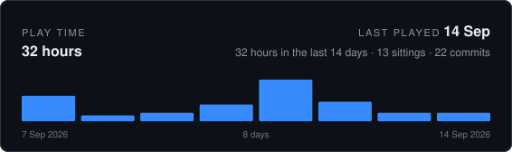

<!-- CODING-TIME:START -->

How this is counted

Commits record when work was saved, never how long it took, so this is an
estimate rather than a timesheet. Commits less than 120 minutes apart
count as one sitting and contribute the real time between them; a commit that
opens a sitting contributes a flat 120 minutes for the work that led up to
it. Merges are skipped, and nothing that was never committed is visible here.

Covers every author. Regenerated on each commit by `.githooks/coding-time`,
which reads commit timestamps and nothing else. `GAP_MINUTES`, `OPENING_MINUTES`,
`RECENT_DAYS` and `DAYS` change what it assumes.

<!-- CODING-TIME:END -->

